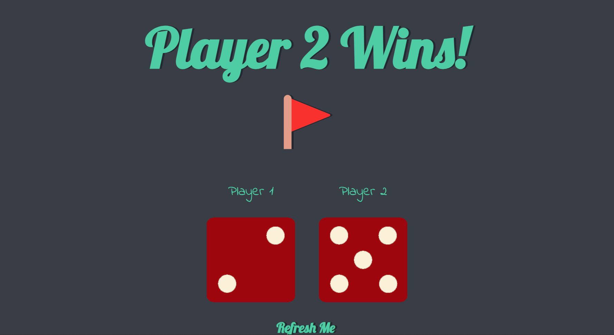

# 🎲 Dice Game
This Dice Game is A Easy and fun way to decide a random winner in a second.


# Interface



***
## Connect with me
<br>
<a href="https://linkedin.com/in/nileshkumargupta05/" target="blank"></a>
<a href="https://stackoverflow.com/users/20517271" target="blank"></a>
<a href="https://instagram.com/_nilesh2202" target="blank"></a>
<a href="https://www.hackerrank.com/guptanilesh417" target="blank"></a>
</p><br>

- [](mailto:guptanilesh417@gmail.com)


***

```python
print("Hello I am Nilesh🙋‍♂️.")
```
```python
print("Nice to meet you. see you soon")
```
```python
print("Show some ❤️ to my Repositories.")
```